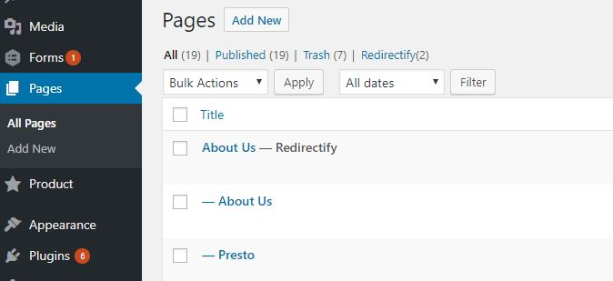
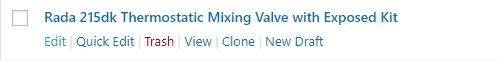

# Page

## Adding a Page

1. To add a new page

 1. On the *Admin Menu*, Click in **Page** and a dropdown will show, then click on **Add New**

 1. On the *Admin Menu*, Click in **Page**. Click on **Add New** beside the title name *Pages* on the *Content Area*

 1. On the *Admin Menu*, hover over **Page** to show a dropdown then click on **Add New**

 1. On the *Admin Bar*, hover over **+ New** link to show a dropdown then click on **Page**

 

1. You can create content by using either Visual(WYSIWYG), Text(HTML) or with Page Builder

  

  1. Visual(WYSIWYG) - please refer to this link to start using Visual(WYSIWYG) https://www.oomphinc.com/notes/2011/11/how-to-use-the-wordpress-wysiwyg-editor/

  1. Text(HTML) - Use Text to add content using HTML tags.

  1. **Page Builder** - please refer to this link to get started with Page Builder https://siteorigin.com/page-builder/documentation/

1. Click the **Publish** button to save and publish this Page post.

  

1. You can click on the info bar **View Post** or the **Permalink** to view your new post.

## Editing a Page

 1. On the *Admin Menu*, Click in **Page** > **All Pages**

 1. Find for the Page on post list at the *Content Area*

 1. Hover over that Page to bring out *actions list* then select **Edit**

   

 1. Proceed to edit your content.

 1. Click on **Update** button to save your changes.

  

## Delete a Page

  1. On the *Admin Menu*, Click in **Page** > **All Pages**

  1. Find for the Page on post list at the *Content Area*

  1. Hover over that Page to bring out *actions list* then select **Trash**

  
